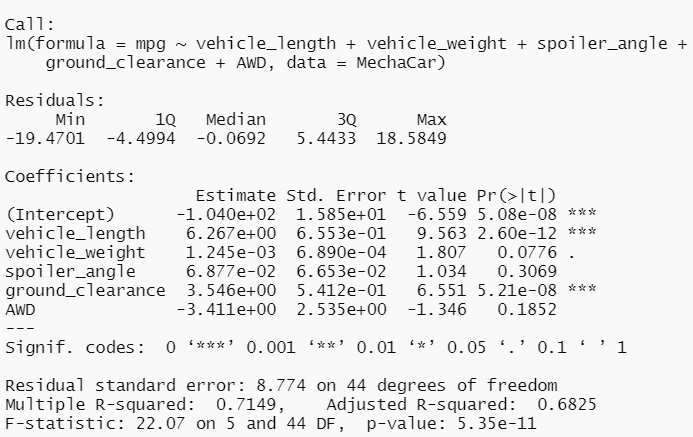
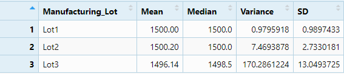
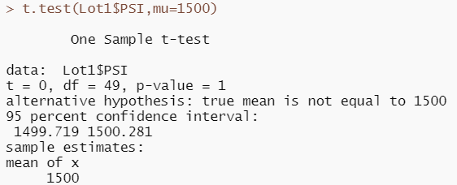
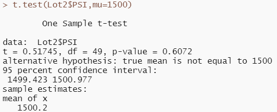
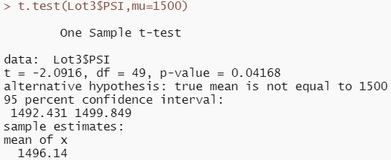

# MechaCar_Statistical_Analysis
## Linear Regression in order to Predict MPG
   * In order to solve the given problemset, "R" was used and a linear regression model was implemented to predict MPG based on the data provided. The data provided was the following:
      * MPG = 6.267(Vehicle Length) + 0.001245(Vehicle Weight) + 0.06877(Spoiler Angle) + 3.546(Ground Clearnace) -3.411(AWD) -0.0104
    
   * The folowing is the R Output:

      

      * This linear regression model provides the information needed to conduct an inference. The last line provides the "P-value" for the entire model which is 5.35e-11. This represents a value of 0 which signifies the model is statistically accurate. The model also provides the Adj. R-squared value which is ~0.70. This is an adequate R-squared value and demonstrates our model predicts MPG ~70% of the time which is more than acceptable.
      * Additionally, in the Co-Efficients table, we can see that the P-values are at a 95% confidence level which means both vehicle length and ground clearance are critical factors in predicting MPG. 
      
## Summary Statistics determining Suspension Coils
   * According to the design specifications for the MechaCar, variance of the suspension coils must **not** exceed 100 pounds per square inch. In order to adhere to these specifications, below are the summary statistics in total by Lot.

    

    

     * As demonstrated by the above images, Lots 1 and 2 have a variance that meets that standard; However, Lot 3's variance does not. Therefore, it is necessary to reexamine Lot 3 and determine what factors can decrease the variancwe. 

## Suspension Coils T-Tests
   * In order to acertain PSI levels across all manufacturing lots are statistically different from the population mean of 1,500 pounds per sq. inch, a T-Test was conducted.

     

     * As demonstrated in the above image, the p-value is ~0.06 which signifies the overall mean of 14987.8 is not distinct at a 95% confidence. 

   * An additional T-test was conducted on each Lot to compare the manufacturing Lot mean vs the Population mean. See below:

     
     |:--:|
     | <b>Lot 1 T-Test</b>|

     * For lot 1, we can see that the p-value is 1 which means that the mean of Lot 1 is equal to the population mean at a 95% confidence level.

     
     |:--:|
     | <b>Lot 2 T-Test</b>|

     * For Lot 2, we can see that the p-value is 0.607 which is still adequate. Additionally, the Lot 2 mean is equal to the population mean at a 95% confidence level.

     
     |:--:|
     | <b>Lot 3 T-Test</b>|

     * As seen in the image above, Lot 3 has a P-value of ~0.04 which is lower than 0.05. This means it is not equal to the population mean at a 95% confidence level.

## Study Design: MechaCar vs Competition
A good way to gain insight on how MechaCar performs against comptitors is to run a statistical study. A metric I would consider measuring is fuel efficiency. A high fuel efficiency means that consumers would be spending less on gas and having less anxiety about runing out of gas while driving. 

To do this study, we would need a null hypothesis and an alternative hypothesis. One option is below:
Null: Drivers fill up their tanks at the same rate regardless of car over 30 days
Alternative: Drivers will fill their tanks up at a rate 10% lower than those of their competitors over 30 days

Using these methods, we could use a t-test on the average number of fill ups for each group of car. We would need data on the number of fill ups that drivers make for each car company to compare.

That is just one way to test how well MechaCar fairs against competition, there are many other routes a statistician can take!
